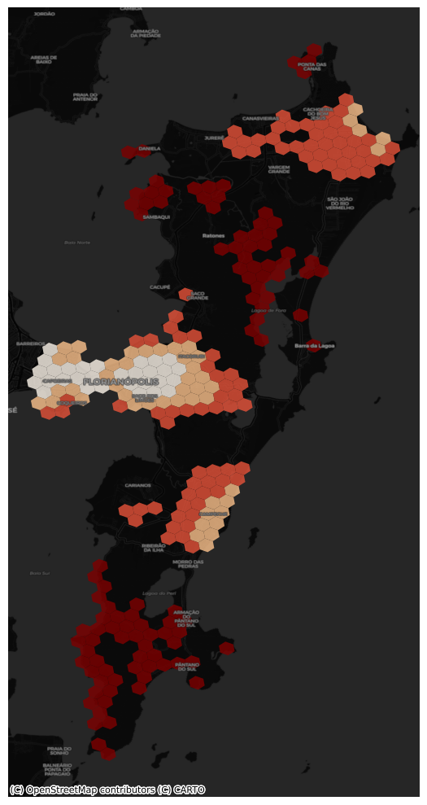

# Data-driven Location of New Schools in Brazil

The goal of this project is to estimate the education infraestructure gap and recommend optimal locations for new schools in Florianopolis and Pará based on capacity, demand, coverage, and location of current schools. To this we will use [UrbanPy](https://doi.org/10.1007/978-3-031-06862-1_34) that leverages public and open-source data for modelling demographics and accesibility to points of interest.

## Tasks

- Demographics and School data collection
- Data cleaning and aggregation
- Exploratory Data Analysis
- Location Modelling
- Results Visualization

## Reports

- Exploratory Data Analysis
  - [Pará](https://el-bid.github.io/edu-brazil/docs/para_data_extraction.html)
  - [Florianópolis](https://el-bid.github.io/edu-brazil/docs/flor_data_extraction.html)

  Interim Report - 11/12/23

## Project Goals

The main goal of this project is to propose a methodology to define the location of new schools in Brazil. This goal have been divided in three sub-goals:

- Estimate the Schools’ Capacity in Brazil. 
- Estimate the Schools’ Accessibility in Brazil.
- Determine the optimal location of new schools according to capacity and accessibility.

## Data Sources

For this purpose we are using as the following data sources:

- [National Census Data from 2010](https://ipeagit.github.io/censobr/)*
- [Schools Census Data from 2022](https://ipeagit.github.io/geobr/)
- [Education Indicators from 2022](https://www.gov.br/inep/pt-br/acesso-a-informacao/dados-abertos/indicadores-educacionais)
- [Meta’s High Resolution Population Density Maps from 2019](https://data.humdata.org/dataset/brazil-high-resolution-population-density-maps-demographic-estimates?)

> *This currently is the most up-to-date census data available for Brazil. Once the 2020 Census Data is available this data can be easily updated through the library GeoBr. 

## Data Pre-processing

The data pre-processing stage is done with UrbanPy, a library developed by the IDB to process high resolution geospatial data, this process consists in (a) data cleaning, (b) selecting relevant variables from each data source, (b) aggregating all variables in H3 Hexagons of resolution 8, a uniform spatial unit that will allow to apply both fast and replicable geographical analysis algorithms to our data.

## School Capacity and Accessibility Estimation

To measure School Capacity four variables have been calculated for each school at education levels and sublevels.

- Average number of students per professor
- Average number of students per classroom
- Average number of students per course
- Proportion of professors by effort level

These variables are designed to represent where the schools are at maximum capacity and we will potentially need more schools and where existing schools can augment the number of students and/or professors to improve their service.

On the other hand, School Accessibility is represented by seven variables at the H3 Hexagon level:

- Population by school-age group
- Average income per capita (Reales)
- Travel time to the nearest school by foot
- Travel time to the nearest school by car
- Number of schools at <1km distance
- Number of schools <15 minutes travel time

These variables are designed to represent the areas in the city where there is a low accessibility to school and to verify which population demographics are most affected considering age and income. For example: “30% of the population between 3 to 5 years is located in areas that don’t have schools in a radius of 1km and the travel time duration to the nearest school is 1 hour or more.”

## Location Analysis

### Proposal 1: Hotspot Analysis

Using the hotspot analysis technique, we could identify areas where School Capacity and Accessibility have statistically low or high values. This allows decision makers to focus on the coldspots (low-low) to promote the location of new schools. Another case is identifying areas with high Capacity and low Accessibility on which better accessibility could mean more students are able to commute to school and receive education.

### Proposal 2: Facility Location Optimization

The Facility Location Problem is an optimization problem that, subject to user-defined constraints, selects the optimal locations for a certain facility from a given set of candidate locations. Traditionally the model uses four main variables as inputs:

Customer demand
Customer cost (usually expressed in travel distance or duration)
Facilities to be selected
Facilities capacity (Optional)
Number of facilities to select

In our case we can obtain variables that better represent the use case. For instance:

Population by group ages
School accessibility metric
Existing Schools and Hexagons with no schools
School capacity

Finally, the FLP model will select an user-defined number of hexagons that represents the optimal geographical areas to locate a new school.

